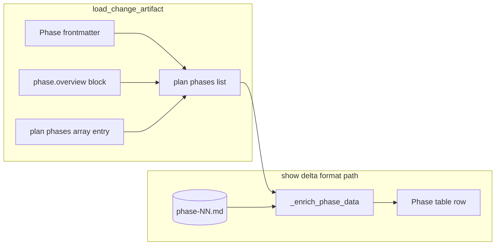

# DR-131 – show delta phase table missing objective — enrich from phase file

## 1. Executive Summary

- **Delta**: [DE-131](./DE-131.md)
- **Status**: approved
- **Last Updated**: 2026-04-10
- **Synopsis**: Make `show delta` phase tables show objectives that already exist on disk by enriching formatter input from the phase file, and write objective into `plan.overview` when `create_phase` emits it in frontmatter.

## 2. Problem & Constraints

### Current behaviour

1. **`_format_plan_overview()`** builds the Rich table from `artifact.plan["phases"]` after `_enrich_phase_data()` adds path and task stats. The Objective column uses `enriched_phase.get("objective")` only; **`_enrich_phase_data()` never sets `objective`** from the phase file.

2. **`load_change_artifact()`** (`artifacts.py`) builds each phase entry in one of two ways:

   - **Canonical** (`PhaseSheet.has_canonical_fields()` — `plan` and `delta` in frontmatter): `phase_entry = sheet.to_phase_entry()` plus `id`/`status`. **It does not read `phase.overview`.** If authors left objective only in a legacy `phase.overview` block (or YAML drift), the in-memory dict has **no** `objective` even though the file contains one.

   - **Legacy**: `extract_phase_overview()` → `phase_block.data` usually includes `objective` when the block defines it.

3. **`_update_plan_overview_phases()`** always appends **`{"id": phase_id}`** only. Even when `create_phase` writes `objective` into phase frontmatter (e.g. copied from an existing plan row via `_extract_phase_metadata_from_plan`), the new plan row stays id-only, so list/plan views that read only `plan.overview` miss objective until hand-edited.

4. **Chicken-and-egg on create**: For a **brand-new** phase id, `_extract_phase_metadata_from_plan()` cannot find a matching row yet, so `phase_metadata` is typically `{}` and default `create_phase` does not add objective to frontmatter. **Gap B** still matters for flows that populate objective before append (template evolution, future CLI, or manual frontmatter before a follow-up sync).

### Drivers / inputs

- User report: Objective column always `-` in `show delta` phase table.
- [PROD-006](file:///home/david/dev/spec-driver/.spec-driver/product/PROD-006/PROD-006.md) — phase visibility and structured metadata (capabilities `phase-visibility`, `phase-creation`).
- [mem.pattern.phase.frontmatter-block-precedence](file:///home/david/dev/spec-driver/.spec-driver/memory/mem.pattern.phase.frontmatter-block-precedence.md) — frontmatter vs block precedence for **loaders**; this DR adds a **display-only** read path when the loaded dict is incomplete (does not change persistence rules in `artifacts.py`).

### Constraints / guardrails

- **Out of scope (DE-131)**: Parsing objective from markdown body / `## 1. Objective` heading; bulk backfill of existing IP files.
- **No clobber**: If `phase` dict already carries a non-empty `objective`, enrichment must not replace it.
- **Formatter purity**: Business rules for “where does objective live on disk” stay delegated to shared parsers (`load_markdown_file` + `PhaseSheet`, `extract_phase_overview`) — avoid duplicating YAML block regex logic beyond what `_enrich_phase_data` already does for tracking.

### Out of scope (design)

- Changing `load_change_artifact()` to merge `phase.overview` into canonical phases (would fight DR-106 “one source wins” for persistence; display enrichment is the scoped fix).
- Adding `entrance_criteria` / `exit_criteria` to the plan table (not shown today).

## 3. Architecture Intent

### Target outcomes

1. **`show delta`**: Objective column shows the first line of structured objective text when it exists in the phase file (frontmatter or `phase.overview`), unless the phase dict already supplied `objective`.
2. **`create phase`**: When the phase frontmatter dict written to disk includes `objective`, the appended `plan.overview` phases entry includes that `objective` so plan and phase file agree.

### Guiding principles

- **Display enrichment is read-only** — no writes from formatter.
- **Single-field resolution** — at most one source contributes `objective` per enrichment pass (frontmatter beats block; no concatenation).
- **Thin `phase_creation` change** — pass known frontmatter fields into plan update; avoid re-reading the file inside `_update_plan_overview_phases` unless a future DR requires it.

### State / lifecycle

- No delta or phase lifecycle enum changes.

### Data flow (target)

Enrichment runs **after** merge, only when `objective` is missing on the dict.

## 4. Code Impact Summary

| Path | Current | Target |
| ---- | ------- | ------ |
| `supekku/scripts/lib/formatters/change_formatters.py` | `_enrich_phase_data()` sets path, tasks, criteria; never `objective`. | After existing logic, if `str(enriched.get("objective", "")).strip()` is empty, read `phase_content` (already loaded or load once): parse frontmatter via `load_markdown_file` split or reuse existing file read; build `PhaseSheet`; if `sheet.objective` non-empty use it; else `extract_phase_overview(phase_content)` and use `data.get("objective")` if non-empty. |
| `supekku/scripts/lib/changes/phase_creation.py` | `_update_plan_overview_phases(plan_path, phase_id)` appends `{"id": phase_id}`. | Add optional parameter(s), e.g. `extra_fields: dict[str, Any] \| None`, or explicit `objective: str \| None`. Build `entry = {"id": phase_id}`; if objective non-empty string, `entry["objective"] = objective`. `create_phase` passes `phase_frontmatter.get("objective")` after building the dict (same values written to disk). |
| `supekku/scripts/lib/formatters/change_formatters_test.py` | VT-PHASE-003 covers table with in-dict objectives. | Add focused tests with temporary delta dirs: phase file on disk + in-memory phase dict missing objective; assert formatted output contains expected objective substring. |
| `supekku/scripts/lib/changes/creation_test.py` | Tests for create_phase / plan overview. | Extend or add cases asserting plan.overview YAML after create includes objective when frontmatter dict would carry it (may require fixture with pre-seeded plan row for metadata extraction, or call `_update_plan_overview_phases` directly with objective). |

## 5. Verification Alignment

| Verification | Impact | Notes |
| ------------ | ------ | ----- |
| VT-131-enrich-fm | new | Canonical frontmatter has `objective`; plan dict has id/status only; enriched output used by table shows objective. |
| VT-131-enrich-overview | new | Legacy `phase.overview` with objective, no objective in frontmatter; dict missing objective; enrichment fills. |
| VT-131-enrich-no-clobber | new | Dict has `objective: "From plan"`; file has different objective; table uses dict value. |
| VT-131-plan-append | new | `_update_plan_overview_phases` writes `objective` key in new row when provided. |
| VA-131-show-delta | new | Run `spec-driver show delta DE-115` (or another delta with phase objectives); document result in `notes.md` or phase sheet. |

> Map concrete tests to existing suite names (`change_formatters_test`, `creation_test`) during `/plan-phases`; IDs above are logical labels.

## 6. Supporting Context

- **DE-106 / PhaseSheet**: Canonical objective lives in frontmatter; `to_phase_entry()` omits key when `objective` is `None`.
- **DE-004**: Introduced `_enrich_phase_data` tracking + regex fallback; same function is the right extension point for file-backed objective.
- **PROD-006.FR-003 / FR-004** (phase visibility): Aligns with “clear phase objectives” in product intent.

## 7. Design Decisions & Trade-offs

### DEC-131-001 — Formatter-side enrichment (accepted)

- **Rationale**: Fixes display for hybrid on-disk state without re-opening DR-106 loader merge policy.
- **Consequence**: Objective can appear in `show delta` even when `ChangeArtifact.plan["phases"]` omits it — **display can be richer than the parsed artifact** until authors fix frontmatter. Acceptable for read-only UX.

### DEC-131-002 — Plan append carries objective (accepted)

- **Rationale**: Reduces drift between `IP-*.md` overview and phase file when objective exists at creation time.
- **Consequence**: For default `create_phase` with empty metadata, behaviour unchanged (still id-only row).

### DEC-131-003 — Precedence (accepted)

1. If dict `objective` non-empty → **stop** (no file read for objective — performance and clobber rule).  
2. Else frontmatter `PhaseSheet.objective` non-empty → use.  
3. Else `phase.overview` dict `objective` if non-empty → use.  
4. Else leave absent (table shows `-`).

### Rejected / deferred

- **Loader merge**: Would violate “one source wins” for canonical phases and increase coupling; deferred indefinitely unless product reverses DR-106 posture.
- **Markdown heading parse**: Explicitly deferred by DE-131.

## 8. Open Questions

None — scope is bounded by DE-131.

## 9. Rollout & Operational Notes

- **Migration**: None; existing phases unchanged on disk.
- **Rollback**: Revert commits touching the two modules and tests.
- **Observability**: Not applicable.

## 10. References & Links

- [DE-131](./DE-131.md)
- `supekku/scripts/lib/changes/artifacts.py` — phase merge logic
- `supekku/scripts/lib/changes/phase_model.py` — `PhaseSheet`, `to_phase_entry()`
- `supekku/scripts/lib/blocks/plan.py` — `extract_phase_overview`

## 11. Adversarial review (internal)

| Attack | Response |
| ------ | -------- |
| “Double file read” — `_enrich_phase_data` already reads file for tracking. | Reuse the same `phase_content` string for objective parsing; avoid second disk hit. |
| Canonical phase with wrong objective in FM and correct in block — which wins? | Frontmatter wins per DEC-131-003; authors must fix FM (consistent with DR-106 authority). |
| YAML multiline objectives break table layout. | Existing table logic takes first line only — unchanged. |
| `create_phase` duplicate-id bug if append-before-dedup. | Pre-existing; out of scope unless touched while editing — if the hunk is modified, preserve current control flow or fix in same PR only if trivial. |
| Tests flaky on path / cwd. | Follow patterns in `change_formatters_test` / `creation_test` with `TemporaryDirectory` and explicit `ChangeArtifact` paths. |
| Malformed `phase.overview` YAML breaks `show delta`. | **Shipped fix:** `_resolve_phase_objective_from_file_body` catches `ValueError` from `extract_phase_overview` and broad-fails frontmatter parse so display stays resilient. |

---

**Next steps (for maintainers)**

1. **Closure**: `spec-driver phase complete DE-131` when ready; then `/audit-change` / complete delta per project policy.
2. **Follow-ups** (DE-131 §8): optional markdown-heading objective parse; plan-phases skill nudge for frontmatter objectives.
