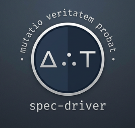

# spec-driver

Your specification-driven development framework construction toolkit, with multi-language spec sync and documentation generation.



## Slow is smooth. Smooth is fast.

**Why should I care?**
- Instead of expensive throwaway research, maintain verifiably accurate, evergreen specs
- Use cheap, fast, deterministically generated contracts to complement and audit the work of messy, stochastic agents
- The combination of markdown and YAML is a surprisingly powerful platform for structured, legible data
- Tooling joins related entities through a registry for fast lookup, validation, and relational data
- A low friction, conceptually coherent, unified CLI for spec-driven development you can adapt as your needs change
- A TUI for browsing project documentation; live agent session follow mode
- If all you care about is ADRs, turn the rest off - it's still super handy
- Token footprint: < 3k to boot with everything activated; skills designed for token-efficiency

**What's it for?**
- a single framework which can scale from low-ceremony kanban, up to the robust process you need for large codebases
- greenfield spec-driven development with Claude Code & friends (Codex, etc)
- legacy conversions (drift ledgers, incremental specification)
- build your own methodology without reinventing wheels

But more than anything else, it's for streamlined development which lets you
focus on focus your attention on what's important.


The machinery required is more complex than more naive approaches (research ->
specify -> plan -> execute) - but it's a very conscious tradeoff.

Spec-driver is not a framework for development from disposable specifications.
It's a framework which drives trustworthy specifications out of implementation.
A machine, if you will, for converting change into truth.

Because: when machines can code, what remains is system design. This is a
system designed to take care of the rest.


A nice little TUI for browsing docs, with fuzzy find.


Fun fact: TUI now supports following a claude code session in real time.

## Getting Started

1. Install spec-driver.
2. Run `spec-driver install` in your repo.
3. Tweak `.spec-driver/workflow.toml` to taste; `spec-driver install` again after edits.
4. Boot up Claude Code or Codex.
5. Tell it what you want to do.

The agent runs the process according to your project settings, so you can learn the rest as you go. Ask it to explain the concepts as you need them.

Add symlinks to the `.spec-driver` subfolders you want convenient access to (optional).

## Installation

### MacOS

```zsh
brew tap davidlee/spec-driver
brew install spec-driver

# try it out
mkdir /tmp/test-driver && cd /tmp/test-driver && git init
spec-driver install
spec-driver doctor
spec-driver tui
# in another window
claude
```

or

```zsh
brew install uv
uv tool install spec-driver
```

### PyPi package

A few options.
```zsh
# try before you buy
uvx spec-driver install

# install as a tool (recommended)
uv tool install spec-driver
spec-driver install

# set up as a python project
uv init
uv add spec-driver
uv run spec-driver install
```

### From GitHub (Development)

```zsh
# Install from latest commit
uv init
uv add git+https://github.com/davidlee/spec-driver
uv run spec-driver --help

# Or use it right off the tubes
uvx --from git+https://github.com/davidlee/spec-driver spec-driver --help
```

### Brew

```zsh
brew tap davidlee/spec-driver
brew install spec-driver
```

### Nix Flake

```zsh
nix profile install github:davidlee/spec-driver
```

Or use the flake input:

```nix
inputs.spec-driver.url = "github:davidlee/spec-driver";
```

[example](./shell.nix) dev shell.

## Extras: Contract generation

If you're writing TypeScript / JavaScript, Go, or Zig, you'll want to install
the appropriate contract doc generator(s):

- [gomarkdoc](https://github.com/princjef/gomarkdoc) - `go install github.com/princjef/gomarkdoc/cmd/gomarkdoc@latest`)]
- [zigmarkdoc](https://github.com/davidlee/zigmarkdoc)
- [ts-doc-extract](https://www.npmjs.com/package/ts-doc-extract) - `npm install -g ts-doc-extract` or `npm install --save-dev ts-doc-extract`

### Install Footprint

All install locations are project-local - no change to your system ~/.claude etc

```bash
# Initialize spec-driver workspace structure
spec-driver install

# This installs :
# - .spec-driver/ (YAML registries & configuration)
# - .claude/ project-local settings & skills
# - .agents/ project-local settings & skills
# - CLAUDE.md - adds a line to invoke boot script
# - AGENTS.md - adds a line to invoke boot script
```

## Quick Start

```zsh
claude
```

If you use Claude Code or Codex, your agent can manage the workflow, and you
can stop reading here.

The rest is for reference if you need it.

## Tool use

All commands are accessed through the unified `spec-driver` CLI.

Depending on how you installed it, you might need to use `uv run spec-driver`.

I suggest adding alias to your `.zshrc` or `.envrc`:

```zsh
alias sdr="spec-driver"
# or
alias sdr="uv run spec-driver"
```
/ agents entries are contingent on project settings.

### Synchronization

```bash
# Idempotent - run after upgrading
spec-driver install

# Sync everything
spec-driver sync

# check all registries
spec-driver validate

# health check
spec-driver doctor
```
```
```

## Caveats

It's opinionated. It installs claude hooks and cross-platform skills
(project-local only), but you can install your own and customize their
behaviour.

It probably doesn't work on Windows, but what does? If you can't afford Linux, I don't know what to tell you.

I'll aim not to make breaking changes to data formats.

## Status

**Beta** - Approaching 1.0

## Features

A smorgasbord for you to build your own workflow around. CLI, TUI, agent memory, skills.

Boot up, install, and ask the agent to show you around.


|Feature|Blurb|
|---|---|
|**Architecture Decision Records (ADRs)**|Record, find, manage and track architectural decisions|
|**Product Specs**|Product requirement docs, with customer-focused value drivers, use cases and personas|
|**Tech Specs**| Start with architectural vision - or fill it in after the fact, scaffolded by deterministically generated documentation|
|**Requirements**| Create and track requirements with categories, tags, and rich lifecycle support - functional, non-functional, technical and product.|
|**Policies & Standards**| Enforce project-wide policies & standards; encourage conventions and sensible defaults|
|**Delta/Change Tracking**|Create a delta to implement a set of requirements or backlog items, deltas, implementation plans and revisions. Record structured data (entry / exit criteria; files and commits) through planning and implementation. Record verification evidence (automated tests, agent or human review), driving requirement status updates.|
|**Backlog Management**|Tooling to create, search & filter Issues, Risks, Problem Statements, Improvements and related artefacts. Prioritise your backlog - just by moving lines up & down in your $EDITOR.|
|**Documentation Generation**|Compact, legible, deterministic markdown documentation from code. Autogenerated spec stubs for new code; change tracking.|
| **Relational Artifacts**  | Documents are linked with rich semantics supported by CLI validation, search and management tools. |
|**Metadata Schema Validation**|Ensure consistency across specification artifacts. CLI tooling support for agents: schema documentation and validation.|
|**Customisable Templates & Agent Commands**|Optionally install templates & commands locally to customise your workflow; fallback to defaults.|
|**Audits & Drift Ledgers**|Record agent (or human) research & inspection to verify implementation, feeding back into requirements & spec status. If you need to manage ambitious programs of work and maintain canonical truth in the face of LLM vomit, there are tools to help. |
|**Spec Revisions**|Optionally contextualize changes to product/architectural specs, with data as structured as makes sense. Start your changes with a revision to capture the design changes - or end with one to represent your findings and what actually happened.|
|**Markdown + Git**|Why use a shitty Saas when version controlled text is this powerful, and agents can work with it so fluently? I'm sure you can pipe it into other, lesser tools if you need it.|
|**Zero Lock-In, Zero Cost**|Things change fast, but if text in open formats goes out of fashion, all bets are off.|


## Related
- [PyPi project](https://pypi.org/project/spec-driver/)
- [A Socratic dialogue wherein I explain the issues with "spec-driven development" which led me to build this thing](https://supekku.dev)
- [superpowers](https://github.com/obra/superpowers) - NGL, I intentionally stole a lot of great ideas from the author
- [me](https://www.linkedin.com/in/davidlee-au/)
- Shout out to [lazyspec](https://github.com/jkaloger/lazyspec/) for TUI ideas

## License

MIT, go nuts.
